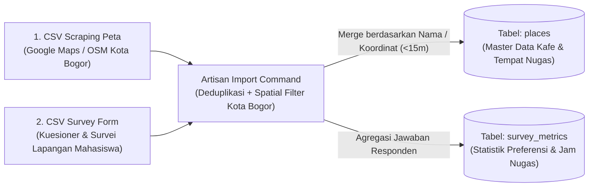

# 📋 Backend Implementation Brief & Security Standard — Go-Around (Laravel 13)

Dokumen ini adalah panduan teknis, standar arsitektur, dan standar keamanan (*security baseline*) untuk tim **Backend (`backend/go-around`)**. Seluruh nama tabel, struktur JSON, dan endpoint di dokumen ini telah diselaraskan **100%** dengan kode **Frontend (`prs-frontend`)** sehingga Backend dapat langsung mengeksekusi tanpa perlu menebak-nebak.

---

## 1. Aturan Bisnis & Batasan Utama (Wajib Dipatuhi)

> [!IMPORTANT]
> **5 Prinsip Inti yang Sudah Dikunci di Frontend:**
> 1. **Cakupan Spasial Murni Kota Bogor (6 Kecamatan)**: Seluruh data tempat (`places`), tiket laporan, dan agregasi analitik hanya mencakup **6 Kecamatan resmi di Kota Bogor**:
>    - `Bogor Tengah`
>    - `Bogor Timur`
>    - `Bogor Utara`
>    - `Bogor Barat`
>    - `Tanah Sareal`
>    - `Bogor Selatan`
>    *(Saat mengimpor CSV hasil scraping, wajib memfilter dan membuang baris yang berada di Kabupaten Bogor seperti Dramaga atau Sentul/Babakan Madang).*
> 2. **Kejujuran Data Atribut (`null` vs Terverifikasi)**: Tempat hasil **CSV Scraping Peta** yang belum disurvei fasilitas dalamnya (Wi-Fi, colokan, kebisingan) **wajib disimpan sebagai `null`** (jangan diisi angka karangan). Setelah digabung dengan **CSV Survey Form**, barulah atribut fasilitas terisi dan berstatus terverifikasi.
> 3. **Laporan & Kontribusi Publik Bersifat Anonim (Tanpa Login)**: Pengunjung WebGIS Publik yang mengirim laporan masalah fasilitas (`/lapor-fasilitas`) atau mengusulkan tempat baru (`/tambah-tempat`) **tidak perlu login** dan **tidak mengisi nama/email pelapor**. Di tabel admin tidak ada kolom nama pelapor (`reportedBy` selalu bernilai `'Anonim'`).
> 4. **Pengaturan Admin Hanya 2 Menu (`Profil Akun` & `Kata Sandi`)**: Tidak perlu membuat tabel `admin_preferences`. Cukup gunakan tabel `users` untuk menyimpan `name`, `email`, `role`, `password`, dan `last_login_at`.
> 5. **Sumber Data Analisis Spasial (`/admin/analytics`)**:
>    - **Preferensi Fasilitas Mahasiswa, Rata-rata Durasi Belajar, & Jam Kunjungan Puncak** diambil dari agregasi **CSV Survey Form Mahasiswa**.
>    - **Total Kueri Spasial, Kepadatan Kueri per Kecamatan, & Konversi Navigasi Rute (Top 5 Kafe)** dihitung dari interaksi di WebGIS Publik (`POST /api/v1/analytics/track`).

---

## 2. Pipeline Import Data: CSV Scraping Peta + CSV Survey Form

Di sisi Backend terdapat **2 sumber file CSV utama** yang harus diimpor melalui **Artisan Command (`php artisan goaround:import-csv`)** atau Seeder:



### 2.1. Lokasi Penyimpanan File CSV Mentah
Simpan kedua file CSV di dalam folder:
- `backend/go-around/database/seeders/data/scraped_places_bogor.csv`
- `backend/go-around/database/seeders/data/student_survey_responses.csv`

### 2.2. Pemetaan Kolom **CSV Scraping Peta** $\rightarrow$ Tabel `places`
1. **Validasi Batas Spasial Kota Bogor**:
   - Tolak baris jika `latitude` di luar rentang `-6.68` s/d `-6.51` atau `longitude` di luar rentang `106.73` s/d `106.86`.
   - Pastikan kolom `subdistrict` ternormalisasi ke salah satu dari 6 Kecamatan Kota Bogor.
2. **Deduplikasi Spasial**:
   - Gunakan pengecekan `slug` (`Str::slug($name)`) atau jarak Haversine $< 15\text{ meter}$ agar kafe yang sama tidak masuk dua kali.
3. **Kolom yang Diisi dari CSV Scraping**:
   - `name`, `slug`, `address`, `subdistrict`, `latitude`, `longitude`, `google_rating`, `total_google_reviews`, `google_maps_url`, `open_time`, `close_time`, `is_24_hours`, `image_url`.
   - Set default `wifi_speed_mbps = null`, `plug_availability = null`, `noise_level = null` jika belum ada di data survei.

### 2.3. Pemetaan Kolom **CSV Survey Form** $\rightarrow$ Pengayaan Tabel `places` & Statistik `/admin/analytics`
Data dari Google Form / survei lapangan mahasiswa memiliki **2 fungsi**:

1. **Fungsi A — Melengkapi Atribut Nugas pada Tabel `places` (*Data Enrichment*)**:
   - Cocokkan nama kafe dari form survei ke tabel `places`, lalu update kolom:
     - `price_min_drink`, `price_max_drink`, dan `price_tier` (`1` jika $< 15.000$, `2` jika $15.000\text{–}28.000$, `3` jika $> 28.000$).
     - `wifi_speed_mbps` (integer Mbps) & `wifi_quality` (`poor` | `fair` | `good` | `excellent`).
     - `plug_availability` (`none` | `limited` | `moderate` | `abundant`).
     - `noise_level` (`quiet` | `moderate` | `lively`).
     - Hitung ulang `nugas_score`, `budget_score`, dan `facility_score` (`0–100`).
2. **Fungsi B — Mengisi Statistik di Halaman Analisis Spasial (`/admin/analytics`)**:
   - **Rata-rata Durasi Belajar (`kpi.avgSessionHours`)**: Rata-rata jawaban responden atas durasi belajar per kunjungan (contoh: `4.2` Jam).
   - **Preferensi Fasilitas Mahasiswa (`preferences`)**: Persentase & jumlah responden yang memilih 5 kriteria utama (*WiFi Cepat*, *Banyak Colokan*, *Ramah Kantong*, *Buka Larut Malam*, *Suasana Tenang*).
   - **Distribusi Waktu Kunjungan (`peakHours`)**: Persentase waktu kunjungan responden (*Pagi 08.00-11.00*, *Siang 12.00-15.00*, *Sore-Malam 16.00-21.00*, *Larut Malam 22.00-02.00*).

---

## 3. Spesifikasi Migrasi Database Baru

Selain tabel `places`, `categories`, `amenities`, `reviews`, dan `contributions` yang **sudah ada** di `backend/go-around/database/migrations`, buatlah **3 migrasi baru** berikut:

### 3.1. Update Tabel `users` (Akun Admin)
```php
Schema::table('users', function (Blueprint $table) {
    $table->string('role', 100)->default('Super Admin SIG Kota Bogor')->after('email');
    $table->timestamp('last_login_at')->nullable()->after('remember_token');
});
```
- **Seeder Wajib (`DatabaseSeeder.php`)**:
  - `name`: `'Admin'`
  - `email`: `'admin@goaround.id'`
  - `password`: `Hash::make('admin123')`
  - `role`: `'Super Admin SIG Kota Bogor'`

### 3.2. Tabel Baru: `facility_reports` (Untuk `/lapor-fasilitas` & `/admin/reports`)
```php
Schema::create('facility_reports', function (Blueprint $table) {
    $table->id();
    $table->string('ticket_code', 20)->unique(); // Contoh: 'TK-802'
    $table->foreignId('place_id')->nullable()->constrained('places')->nullOnDelete();
    $table->string('cafe_name');                 // Nama kafe yang dilaporkan
    $table->string('location', 100);             // Contoh: 'Bogor Tengah, Kota Bogor'
    $table->string('category', 100);             // 'Colokan Rusak' | 'WiFi Tidak Stabil' | 'Update Jam Operasional' | 'Usulan Spot Nugas Baru'
    $table->enum('priority', ['high', 'medium', 'suggestion', 'low'])->default('medium');
    $table->text('description');                 // Isi laporan dari pengunjung
    $table->string('time_estimate', 30)->default('hari_ini'); // 'hari_ini' | 'kemarin' | 'pekan_ini' | 'lebih_7_hari'
    $table->json('evidence_photos')->nullable(); // Array path bukti foto: { "colokan": "...", "speedtest": "...", "menu": "..." }
    $table->enum('status', ['open', 'resolved', 'dismissed'])->default('open')->index();
    $table->boolean('is_unread')->default(true)->index();
    $table->text('internal_note')->nullable();   // Catatan tindakan admin
    $table->timestamps();
});
```

### 3.3. Tabel Baru: `spatial_analytics_events` (Tracking Kueri & Klik Rute dari WebGIS Publik)
```php
Schema::create('spatial_analytics_events', function (Blueprint $table) {
    $table->id();
    $table->enum('event_type', ['spatial_query', 'route_click'])->index();
    $table->foreignId('place_id')->nullable()->constrained('places')->nullOnDelete();
    $table->string('subdistrict', 100)->nullable()->index(); // 'Bogor Tengah', 'Bogor Timur', dll.
    $table->string('query_text', 255)->nullable();
    $table->string('session_hash', 64)->nullable()->index(); // SHA-256(IP + UserAgent + Tanggal) — aman secara privasi (tanpa simpan IP mentah)
    $table->timestamps();
});
```

---

## 4. Standar Keamanan Backend (Security Checklist — WAJIB)

Agar aplikasi aman dari serangan umum (*Brute Force, SQL Injection, XSS, Malicious File Upload, Spam Form Publik, dan Token Leak*), Backend **wajib** menerapkan 7 pengamanan berikut:

### 4.1. Autentikasi Laravel Sanctum & Masa Berlaku Token
1. Gunakan **Laravel Sanctum** (`HasApiTokens` pada model `User`).
2. Set masa kedaluwarsa token di `config/sanctum.php`:
   ```php
   'expiration' => 60 * 12, // 12 jam sesi kerja admin
   ```
3. Seluruh route `/api/v1/admin/*`, `/api/v1/auth/logout`, dan `/api/v1/auth/me` **wajib** dibungkus middleware `auth:sanctum`.

### 4.2. Rate Limiting (Anti Brute-Force & Anti Spam Form Publik)
Daftarkan `RateLimiter` di `AppServiceProvider::boot()`:
```php
// 1. Proteksi Login Admin (Maksimal 5 percobaan gagal per menit per IP)
RateLimiter::for('admin-login', function (Request $request) {
    return Limit::perMinute(5)->by($request->ip())->response(function () {
        return response()->json([
            'status' => 'error',
            'message' => 'Terlalu banyak percobaan masuk. Silakan tunggu 1 menit.',
        ], 429);
    });
});

// 2. Proteksi Form Publik Anonim (/lapor-fasilitas & /contributions) — Maks 6 kiriman per 10 menit per IP
RateLimiter::for('public-submission', function (Request $request) {
    return Limit::perMinutes(10, 6)->by($request->ip())->response(function () {
        return response()->json([
            'status' => 'error',
            'message' => 'Batas pengiriman laporan tercapai. Silakan coba beberapa saat lagi.',
        ], 429);
    });
});

// 3. Proteksi Tracking Analytics — Maks 60 event per menit per IP
RateLimiter::for('analytics-track', function (Request $request) {
    return Limit::perMinute(60)->by($request->ip());
});
```

### 4.3. Validasi Input Ketat & Sanitasi XSS (`FormRequest`)
- Karena `/lapor-fasilitas` dan `/contributions` bersifat publik tanpa login, bersihkan tag HTML berbahaya menggunakan `strip_tags()` sebelum menyimpan ke database:
  ```php
  'description' => ['required', 'string', 'min:10', 'max:1000'],
  // Sebelum simpan:
  $cleanDescription = strip_tags($validated['description']);
  ```
- Gunakan `$fillable` secara eksplisit di semua Model (`User`, `Place`, `Contribution`, `FacilityReport`, `SpatialAnalyticsEvent`). **Jangan pernah** menggunakan `$guarded = []` atau `$request->all()`.

### 4.4. Keamanan Query Spasial (Anti SQL Injection)
- Pada query Haversine (`SpatialSearchService.php`), selalu gunakan *parameter bindings* (`?` atau `(float)` casting eksplisit), jangan pernah mengonkat string langsung dari `$request->input('lat')` ke dalam `DB::raw()`.

### 4.5. Konfigurasi CORS (`config/cors.php`)
- Jangan gunakan `'allowed_origins' => ['*']` di production. Gunakan environment variable:
  ```php
  'paths' => ['api/*'],
  'allowed_methods' => ['GET', 'POST', 'PUT', 'PATCH', 'DELETE', 'OPTIONS'],
  'allowed_origins' => explode(',', env('CORS_ALLOWED_ORIGINS', 'http://localhost:3000,http://127.0.0.1:3000')),
  'allowed_headers' => ['Content-Type', 'X-Requested-With', 'Authorization', 'Accept'],
  'supports_credentials' => false,
  ```

### 4.6. Privasi Pengunjung pada Analytics
- Jangan menyimpan alamat IP mentah mahasiswa di tabel `spatial_analytics_events`. Simpan sebagai hash harian satu arah:
  ```php
  $sessionHash = hash('sha256', $request->ip() . '|' . $request->userAgent() . '|' . now()->toDateString());
  ```

### 4.7. Keamanan Upload Bukti Foto Publik (Anti *Malicious File Upload*)
- Pada endpoint `/api/v1/facility-reports` dan `/api/v1/contributions`, validasi file gambar secara ketat (hanya ekstensi & MIME gambar asli, maksimal 5 MB) dan simpan dengan nama acak (`store('reports', 'public')`), **jangan pernah** menggunakan nama file asli dari client (`getClientOriginalName()`):
  ```php
  'photo_colokan'   => ['nullable', 'image', 'mimes:jpg,jpeg,png,webp', 'max:5120'],
  'photo_speedtest' => ['nullable', 'image', 'mimes:jpg,jpeg,png,webp', 'max:5120'],
  'photo_menu'      => ['nullable', 'image', 'mimes:jpg,jpeg,png,webp', 'max:5120'],
  ```

---

## 5. Kontrak Lengkap Endpoint REST API

> [!TIP]
> Di Frontend **sudah tersedia file [`prs-frontend/lib/api-admin.ts`](file:///Users/admin/code/code-kuliah/pjbl/sig/Go-around/prs-frontend/lib/api-admin.ts)**. Pastikan URL route dan struktur JSON di Laravel persis mengikuti tabel di bawah ini.

### A. Autentikasi & Profil Admin
| Method | Endpoint | Middleware | Request Body | Response JSON (`200 OK`) |
|---|---|---|---|---|
| `POST` | `/api/v1/auth/login` | `throttle:admin-login` | `{ "email": "admin@goaround.id", "password": "admin123" }` | `{ "status": "success", "token": "1|sanctum...", "user": { "name": "Admin", "email": "admin@goaround.id", "role": "Super Admin SIG Kota Bogor", "avatarInitials": "AD", "lastLogin": "Hari ini, 14:30 WIB" } }` |
| `POST` | `/api/v1/auth/logout` | `auth:sanctum` | — | `{ "success": true }` |
| `GET` | `/api/v1/auth/me` | `auth:sanctum` | — | `{ "data": { "name": "Admin", "email": "admin@goaround.id", "role": "Super Admin SIG Kota Bogor", "avatarInitials": "AD", "lastLogin": "..." } }` |
| `PUT` | `/api/v1/admin/profile` | `auth:sanctum` | `{ "name": "Admin", "email": "admin@goaround.id", "role": "..." }` | `{ "data": { ...profilTerbaru } }` |
| `PUT` | `/api/v1/admin/password` | `auth:sanctum` | `{ "current_password": "...", "new_password": "..." }` | `{ "success": true, "message": "Kata sandi berhasil diperbarui." }` *(atau `422` jika `current_password` salah)* |
| `POST` | `/api/v1/auth/forgot-password` | `throttle:admin-login` | `{ "email": "admin@goaround.id" }` | `{ "status": "success", "message": "Tautan pemulihan terkirim." }` |

---

### B. Kelola Kafe & Moderasi Usulan (`/admin/places`)

#### 1. `GET /api/v1/admin/places` (`auth:sanctum`)
Mengambil daftar tempat di Kota Bogor dalam format yang langsung siap dirender oleh tabel `/admin/places`:
```json
{
  "status": "success",
  "data": [
    {
      "id": 1001,
      "code": "KF-001",
      "name": "Maraca Books and Coffee",
      "address": "Jl. Jalak Harupat No. 9A, Babakan, Bogor Tengah",
      "district": "Bogor Tengah",
      "lat": -6.5976,
      "lng": 106.7997,
      "wifi": 65,
      "plug": 82,
      "plugLabel": "Banyak",
      "price": "Rp 18.000 - Rp 38.000",
      "priceCategory": "15k-30k",
      "acoustic": "Tenang",
      "is24Hours": false,
      "score": 9.3,
      "status": "verified",
      "isUnread": false,
      "imageUrl": "https://..."
    }
  ]
}
```

#### 2. Endpoint Mutasi Kafe (`auth:sanctum`)
- `POST /api/v1/admin/places` $\rightarrow$ Tambah tempat baru oleh Admin.
- `PUT /api/v1/admin/places/{id}` $\rightarrow$ Edit data kafe oleh Admin.
- `DELETE /api/v1/admin/places/{id}` $\rightarrow$ Hapus tempat.
- `PATCH /api/v1/admin/places/{id}/verify` $\rightarrow$ Ubah status kafe dari `review`/`pending` menjadi `verified`/`active` agar tampil di peta WebGIS Publik.
- `PATCH /api/v1/admin/places/{id}/reject` $\rightarrow$ Ubah status menjadi `rejected`.

---

### C. Tiket Laporan Fasilitas (`/lapor-fasilitas` & `/admin/reports`)

#### 1. `POST /api/v1/facility-reports` (`throttle:public-submission`)
Dipanggil saat pengunjung mengirim laporan di `/lapor-fasilitas` (minimal 1 bukti foto wajib dilampirkan):
```json
{
  "place_id": 1001,
  "cafe_name": "Maraca Books and Coffee",
  "location": "Bogor Tengah, Kota Bogor",
  "category": "Colokan Rusak",
  "description": "Colokan di meja sudut lantai 2 mati.",
  "time_estimate": "hari_ini",
  "evidence_photos": {
    "colokan": "https://.../storage/reports/abc123.jpg",
    "speedtest": null,
    "menu": null
  }
}
```

#### 2. `GET /api/v1/admin/tickets` (`auth:sanctum`)
```json
{
  "status": "success",
  "data": [
    {
      "id": "TK-802",
      "priority": "high",
      "category": "Colokan Rusak",
      "cafeName": "Maraca Books and Coffee",
      "location": "Bogor Tengah, Kota Bogor",
      "timeAgo": "24 menit yang lalu",
      "reportedBy": "Anonim",
      "description": "Colokan di meja sudut ruang baca lantai 2 ada 3 titik yang longgar dan mati total saat dipakai cas laptop.",
      "status": "open",
      "isUnread": true,
      "internalNote": null
    }
  ]
}
```

#### 3. Endpoint Moderasi Tiket (`auth:sanctum`)
- `PATCH /api/v1/admin/tickets/{ticket_code}/resolve` (Body opsional: `{ "internal_note": "..." }`)
- `PATCH /api/v1/admin/tickets/{ticket_code}/dismiss`
- `PATCH /api/v1/admin/tickets/{ticket_code}/read`
- `POST /api/v1/admin/tickets/mark-all-read`

---

### D. Tracking & Overview Analisis Spasial (`/admin/analytics`)

#### 1. `POST /api/v1/analytics/track` (`throttle:analytics-track`)
Dipanggil otomatis dari WebGIS Publik (`/`) saat pengguna melakukan pencarian/filter (`spatial_query`) atau menekan tombol **`Petunjuk Arah (Maps)`** (`route_click`):
```json
{
  "event_type": "route_click",
  "place_id": 1001,
  "subdistrict": "Bogor Tengah",
  "query_text": null
}
```

#### 2. `GET /api/v1/admin/analytics/overview?time_range=30d` (`auth:sanctum`)
Mengembalikan objek `kpi` (untuk Dashboard `/admin`) dan `analytics` (untuk halaman `/admin/analytics`) sesuai struktur di `prs-frontend/lib/api-admin.ts`.

---

## 6. Checklist File yang Harus Dibuat di `backend/go-around/`

Agar struktur folder Laravel tetap rapi dan standar, berikut daftar file yang perlu dibuat oleh tim Backend:

- [ ] **Migrations (`database/migrations/`)**:
  - `2026_08_27_000001_add_admin_fields_to_users_table.php`
  - `2026_08_27_000002_create_facility_reports_table.php`
  - `2026_08_27_000003_create_spatial_analytics_events_table.php`
- [ ] **Models (`app/Models/`)**:
  - Update `User.php` (tambahkan `HasApiTokens` dari Laravel Sanctum)
  - Buat `FacilityReport.php`
  - Buat `SpatialAnalyticsEvent.php`
- [ ] **Artisan Command Import CSV (`app/Console/Commands/`)**:
  - Buat `ImportBogorPlacesCommand.php` (`php artisan goaround:import-csv`) untuk mengimpor CSV Scraping Peta + CSV Survey Form Mahasiswa.
- [ ] **Controllers (`app/Http/Controllers/Api/`)**:
  - `Admin/AuthController.php` (`login`, `logout`, `me`, `updateProfile`, `changePassword`, `forgotPassword`)
  - `Admin/AdminPlaceController.php` (`index`, `store`, `update`, `destroy`, `verify`, `reject`)
  - `Admin/AdminTicketController.php` (`index`, `resolve`, `dismiss`, `markRead`, `markAllRead`)
  - `Admin/AdminAnalyticsController.php` (`overview`, `exportGeoJson`)
  - `FacilityReportController.php` (`store` — publik)
  - `AnalyticsTrackingController.php` (`track` — publik)
- [ ] **Routes (`routes/api.php`)**:
  - Tambahkan grup route publik (`facility-reports`, `analytics/track`, `auth/login`) dan grup route terproteksi `Route::middleware('auth:sanctum')->prefix('admin')->group(...)`.
